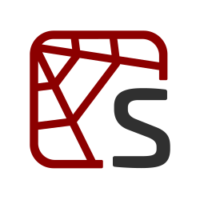

#### Hi there 👋
<h1> I am Jeg Dudley 🌊 </h1>

#### Experienced in:
 

#### Currently learning:

#### Stats:

<!-- vue -->
<!-- github-light -->

<!-- calmly coding 🌊 -->
<!-- <h1>🌊 🐠 🐒</h1> -->
<!-- <h3>🌊 🐠 🐒</h3> -->

<!-- :octocat: -->
<!--  -->
<!-- Leave :octocat: at the end. -->

